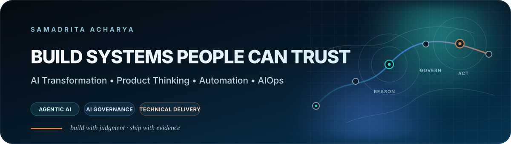

  

<h1 align="center">Samadrita Acharya</h1>

  <b>Enterprise AI · Agentic Systems · Product & Platform Thinking · Automation · Technical Delivery</b>

  I build governed AI and operational products that turn complex workflows into systems teams can trust, measure, and improve.

  
  
  
  
  
  
  
  

> **Build systems that are useful enough to adopt, safe enough to trust, and clear enough to improve.**

---

## Featured flagship project

### 🧠 [KnowledgeOps AI — Enterprise Agentic RAG Platform](https://github.com/Samadritaacharya/knowledgeops-ai-enterprise-agentic-rag)

**Evidence-backed enterprise decisions with governed human authority.**

KnowledgeOps AI turns synthetic engineering, procurement, commercial, cybersecurity and revision-controlled evidence into inspectable decision support. It combines **LangChain, LangGraph, hybrid retrieval, FastAPI, Qdrant-ready vector search, Next.js and TypeScript** with an explicit human approval boundary.

The public app is live in a transparent zero-key deterministic mode; the repository separately verifies a real FastAPI + LangGraph `interrupt()`/resume path with same-thread approve/edit/reject semantics.

**Engineering proof**

- **60/60** evaluation cases retrieve at least one expected source in top-6
- **0.9514** mean expected-document recall@6
- **8/8** Python unit/governance tests
- **8/8** TypeScript engine/bridge tests
- real LangGraph HITL approve/edit/reject E2E
- local Qdrant vector-query verification
- Docker build verification
- protected `main` with required Python + Web CI
- external production smoke against the live Vercel deployment

`Python` `LangChain` `LangGraph` `FastAPI` `Qdrant` `BM25` `Next.js` `TypeScript` `Docker` `GitHub Actions` `Vercel`

### [🚀 Open live app →](https://knowledgeops-ai-enterprise-agentic-six.vercel.app/) · [View source →](https://github.com/Samadritaacharya/knowledgeops-ai-enterprise-agentic-rag) · [Verification →](https://github.com/Samadritaacharya/knowledgeops-ai-enterprise-agentic-rag/blob/main/VERIFICATION.md)

---

## Featured systems project

### 🔌 [MCPBridge — Enterprise Agent Integration Gateway](https://github.com/Samadritaacharya/mcpbridge-enterprise-agent-integration)

**Give AI agents tools while keeping permissions, human authority and auditability outside the model.**

MCPBridge is a multi-domain **Model Context Protocol integration and governance gateway** across synthetic GitHub, ITSM and business systems. It uses the official MCP Python SDK v2, FastAPI and LangGraph, applies a fail-closed server/tool allowlist and role/effect policy, blocks sensitive writes behind explicit human approve/edit/reject, and records tamper-evident audit events.

The public Next.js command center is deployed on Vercel in a transparent zero-key deterministic demo mode. The repository separately verifies the connected **Next.js → FastAPI → policy → official MCP client → MCP tool** path end to end, while an external production smoke test validates the live Vercel app against the exact deployed Git SHA after `main` updates.

`MCP Python SDK v2` `LangGraph` `FastAPI` `Next.js 16` `TypeScript` `Human-in-the-Loop` `Docker` `GitHub Actions` `Vercel`

### [🚀 Open live app →](https://mcpbridge-enterprise-agent-integrat-seven.vercel.app/) · [View source →](https://github.com/Samadritaacharya/mcpbridge-enterprise-agent-integration)

---

## What I build

| Governed AI | Product & Platform | Reliability & Operations |
|---|---|---|
| Agentic RAG, HITL workflows, retrieval evaluation, policy boundaries, grounded reasoning | Developer-platform experiences, product analytics, experimentation, roadmap evidence | AIOps, ITSM/ITOM, incident workflows, service health, SLA and change governance |

I am most interested in the point where **technology becomes operationally useful**: clear ownership, measurable controls, reliable workflows, explainable decisions, safe automation, and evidence that teams can act on.

---

## Selected project portfolio

<table>
<tr>
<td width="50%" valign="top">

### 🛡️ [AutonomousOps](https://github.com/Samadritaacharya/autonomousops-incident-response-agent)
**AI Incident Governance & Service Recovery**

Event-driven incident response with deterministic risk controls, grounded runbook retrieval, human approval gates, simulated remediation, stakeholder communication, and auditable AgentOps.

`Python` `Next.js` `FastAPI` `GitHub Actions` `Docker` `Vercel`

[🚀 Open live app →](https://autonomousops-incident-response-age.vercel.app/) · [View source →](https://github.com/Samadritaacharya/autonomousops-incident-response-agent)

</td>
<td width="50%" valign="top">

### ⭐ [PlatformPulse](https://github.com/Samadritaacharya/platformpulse-developer-platform)
**Developer Platform Product Lab**

Developer discovery, secure golden paths, service ownership, CI/CD and SLO metrics, experimentation, AI governance, reliability, and evidence-based roadmap decisions in one platform-product case.

`Python` `Next.js` `Streamlit` `Docker` `Kubernetes` `CI/CD`

[Open live product →](https://samadritaacharya.github.io/platformpulse-developer-platform/) · [View source →](https://github.com/Samadritaacharya/platformpulse-developer-platform)

</td>
</tr>
<tr>
<td width="50%" valign="top">

### 🧠 [AIGate](https://github.com/Samadritaacharya/aigate-ai-procurement-governance)
**AI Procurement, Governance & Value Control Plane**

Screens proposed AI systems for governance and procurement risk, maps missing evidence and approval routes, evaluates vendor readiness, quantifies ROI/payback, and keeps optional model reasoning advisory while deterministic policy owns authority.

`Python` `Next.js` `FastAPI` `AI Governance` `Procurement` `Docker` `Vercel`

[🚀 Open live app →](https://aigate-ai-procurement-governance-git-fix-eea249-riria5779-4847.vercel.app/#evidence) · [View source →](https://github.com/Samadritaacharya/aigate-ai-procurement-governance)

</td>
<td width="50%" valign="top">

### 🛡️ [RegOps EU](https://github.com/Samadritaacharya/eu-cyber-resilience-regops)
**Cyber Resilience Operations Platform**

Turns CycloneDX SBOM, vulnerability, and incident evidence into deterministic CRA + German NIS2 screening, reporting clocks, evidence-gap analysis, human approval routes, and auditable regulatory report drafts.

`Python` `Next.js` `FastAPI` `CycloneDX` `CRA` `NIS2` `Docker` `Vercel`

[🚀 Open live app →](https://eu-cyber-resilience-regops-frontend.vercel.app/) · [View source →](https://github.com/Samadritaacharya/eu-cyber-resilience-regops)

</td>
</tr>
<tr>
<td width="50%" valign="top">

### 🧭 [AI ResearchOps Control Tower](https://github.com/Samadritaacharya/ai-researchops-control-tower)
**Governance for uncertain AI/ML initiatives**

AI initiative intake, uncertainty management, RAID, RACI, experiments, governance, roadmaps, steering, and product handover in a decision-oriented workspace.

`Python` `Next.js` `Streamlit` `AI Governance` `PMO`

[Open live app →](https://ai-researchops-control-tower.streamlit.app/) · [View source →](https://github.com/Samadritaacharya/ai-researchops-control-tower)

</td>
<td width="50%" valign="top">

### ☁️ [CloudOps / AIOps Reliability Dashboard](https://github.com/Samadritaacharya/cloudops-aiops-reliability-dashboard)
**AIOps Reliability & Operational Intelligence**

Anomaly detection, alert prioritization, deployment-impact analysis, service-health scoring, runbook guidance, and executive RAG reporting for cloud operations.

`Python` `scikit-learn` `AIOps` `Observability` `Streamlit`

[Open live app →](https://cloudops-aiops-reliability-dashboard.streamlit.app/) · [View source →](https://github.com/Samadritaacharya/cloudops-aiops-reliability-dashboard)

</td>
</tr>
<tr>
<td width="50%" valign="top">

### 📈 [ITSM Incident & SLA Analytics](https://github.com/Samadritaacharya/itsm-incident-sla-analytics)
**Service Reliability & Operational Decision Support**

SLA breach risk, MTTR, root cause, change impact, service health, and owner-ready operational actions for service-management and reliability decisions.

`Python` `Next.js` `Analytics` `ITSM` `Service Reliability`

[Open live app →](https://itsm-incident-sla-analytics.streamlit.app/) · [View source →](https://github.com/Samadritaacharya/itsm-incident-sla-analytics)

</td>
<td width="50%" valign="top">

### 🗣️ [Meeting Intelligence Agent](https://github.com/Samadritaacharya/meeting-intelligence-agent)
**Meeting-to-Workflow Automation**

Transforms meeting transcripts into structured decisions, actions, risks, questions, PMO status, follow-up communication, and export-ready workflow outputs.

`Python` `AI Workflow` `Automation` `Streamlit` `Structured Exports`

[Open live app →](https://meeting-intelligence-agent.streamlit.app/) · [View source →](https://github.com/Samadritaacharya/meeting-intelligence-agent)

</td>
</tr>
<tr>
<td width="50%" valign="top">

### 🛍️ [Tech Retail Operations Intelligence](https://github.com/Samadritaacharya/tech-retail-operations-intelligence)
**Retail Operations & Cross-Functional Action Planning**

Fulfilment, checkout failures, returns, support pressure, inventory risk, campaign impact, and owner-ready action planning across retail operations.

`Python` `Analytics` `Operations` `PMO` `Streamlit`

[Open live app →](https://tech-retail-operations-intelligence.streamlit.app/) · [View source →](https://github.com/Samadritaacharya/tech-retail-operations-intelligence)

</td>
<td width="50%" valign="top">

### 🗂️ [Explore all repositories](https://github.com/Samadritaacharya?tab=repositories)
**More systems, experiments & supporting builds**

Browse the full repository portfolio for additional product, automation, analytics, AI-governance, reliability, and engineering work.

`GitHub` `Portfolio` `Open Source`

[Explore repositories →](https://github.com/Samadritaacharya?tab=repositories)

</td>
</tr>
</table>

---

## How I work

| Principle | What it means in my projects |
|---|---|
| **Evidence before claims** | Reproducible evaluation, tests, CI, synthetic fixtures, explicit limitations and external smoke checks |
| **Governance by design** | Human approval, allowlists, deterministic policy boundaries, audit traces |
| **Product thinking** | Start with the user or operating problem, then design the workflow and measurable outcome |
| **Safe automation** | Separate reasoning from authority; simulate risky actions until controls are production-ready |
| **Operational clarity** | Make ownership, state, risk, evidence and next actions visible |

---

## Toolkit

  
  
  
  
  
  
  
  
  
  
  

**AI & data:** Python · SQL · Pandas · NumPy · scikit-learn · LangChain · LangGraph · RAG evaluation · retrieval · agentic workflows  
**Product & delivery:** technical program delivery · PMO · RAID · RACI · requirements · roadmaps · stakeholder alignment · executive reporting  
**Cloud & operations:** AIOps · observability · ITSM/ITOM · incident · problem · change · SLA · service health  
**Build:** Next.js · React · TypeScript · FastAPI · Streamlit · GitHub Actions · Docker · Vercel · Jira · ServiceNow

---

## Background

**SAP SE** — cloud delivery architecture, AIOps, sovereign-cloud and PMO workflows  
**IBM / Kyndryl** — enterprise IT service operations and ITSM/ITOM delivery  
**ISRO & CSIR-CIMFR** — applied AI/ML research, including deep-learning satellite-image classification

**RWTH Aachen University** — M.Sc. Management & Engineering · Technology, Innovation, Marketing & Entrepreneurship  
**Computer Science & Engineering** — bachelor's degree

---

## Connect

  
  
  

Public demos use synthetic data and portfolio-safe scenarios. No confidential employer, client, customer, university, or personal data is used.

